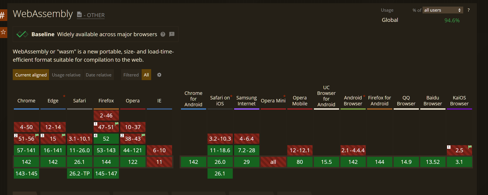
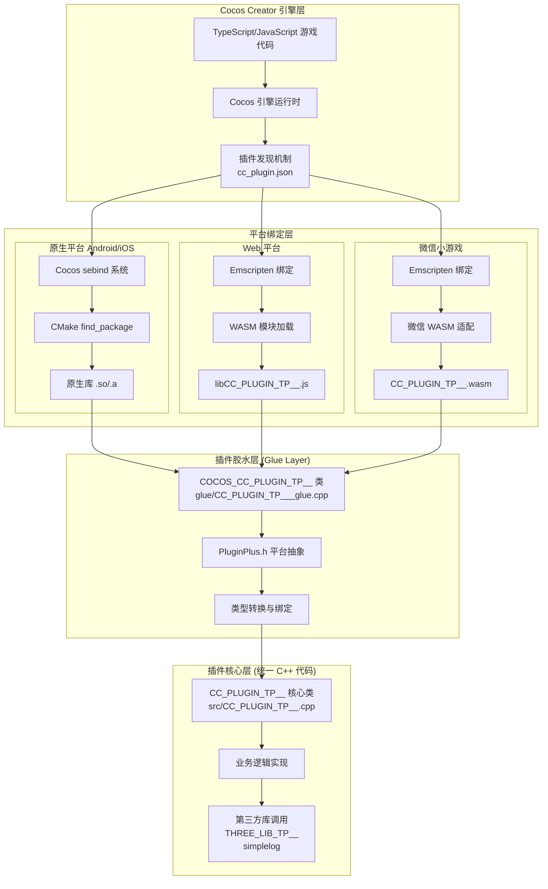

# 打通三界：Cocos C++ 全平台开发的最后一公里实践

### 🔥 本文亮点

1. **跨平台一致性** - 一套C++代码，在Android、iOS、Web、微信小游戏等平台上完美运行。
2. **无缝升级引擎** - 无需修改引擎代码，即可无缝升级Cocos Creator版本。
3. **快速集成** - 完美融入Cocos Creator的工作流，与现有项目无缝集成。无需复杂的引擎配置,只需要将你的代码放到对应的文件夹,直接构建脚本即可。

## 前言：C++全平台的梦想，终于照进现实

### 那些年，我们错过的C++世界

还记得那些年吗？当我们看到Unity开发者可以轻松调用C++库，当我们羡慕Unreal Engine的强大性能，当我们渴望在Cocos Creator中使用那些令人垂涎的C++扩展库时，内心总是充满了无奈。

**OpenCV**的图像处理能力，**FFmpeg**的音视频处理，**TensorFlow**的机器学习，**SQLite**的数据库操作，**zlib**的压缩算法... 这些在C++世界中闪闪发光的库，曾经离我们那么近，却又那么远。

我们只能眼巴巴地看着，看着那些强大的功能在原生应用中大放异彩，而我们的Web游戏却只能使用JavaScript的"阉割版"实现。性能的差距，功能的缺失，让我们在竞争中处于劣势。

### WebAssembly：改变一切的技术革命

但是，**WebAssembly（WASM）**的出现，彻底改变了这一切！

这个看似简单的技术，却蕴含着巨大的能量。它让C++代码能够在浏览器中运行，性能接近原生，让那些曾经只能在桌面和移动端使用的强大库，随着覆盖率的提升,终于可以在Web平台上大显身手。

想象一下，你的游戏可以在Web上使用OpenCV进行实时图像处理，使用FFmpeg进行音视频编解码，使用TensorFlow进行AI推理, 这一切，都因为WebAssembly而成为可能！

看一下兼容性,目前基本上已经全面覆盖了




### 最后一公里的挑战

- 仅仅有WebAssembly还不够。同样一份C++,没法同时在Native和Web之间直接使用,还需要专门为原生和web单独出一份相同功能的绑定逻辑
- 深受2.x的影响,是否一定要修改引擎才能整合自己的功能,如何在不修改引擎的情况下，整合自己的功能
- 绑定逻辑的复杂性，复杂的环境整合配置,如何简化这个过程
- 如何在不修改引擎的情况下,管理自己的引擎代码
- 在升级引擎时，如何保证自己的代码不被破坏,实现无缝无脑升级引擎


所以我们还需要一个桥梁，一个能够将C++的强大能力无缝集成到Cocos Creator生态中的桥梁。

因此本文就带你一起探索如何打通Cocos C++全平台的最后一公里。


### 🚀 被忽视的原生插件系统

>Cocos Creator 3.x 引入了强大的原生插件系统，允许开发者在不修改引擎源码的情况下，通过标准的 `cc_plugin.json` 配置文件和 CMake 构建系统，轻松集成原生 C++ 代码。这个系统遵循官方标准，支持 Android、iOS、Windows、macOS 等所有原生平台，通过 `find_package` 机制自动管理依赖和链接。然而，由于缺乏 Web 平台支持和统一的跨平台绑定方案，许多开发者往往忽视了它的存在，或者因为配置复杂而望而却步。实际上，原生插件系统正是打通 C++ 全平台的关键基础设施。

**但是还是要给设计这个原生插件系统的大佬点赞,他完美解决了原生代码解耦引擎的问题,使我们可以方便的集成自己的代码,并且不影响引擎本身的升级。**


### 注意: 官方原生插件是3x的,所以不支持2x,所以本文章支持cocos creator 3.6+版本。具体可以查看[官方文档](https://docs.cocos.com/creator/3.8/manual/zh/advanced-topics/native-plugins/brief.html#%E5%8E%9F%E7%94%9F%E6%8F%92%E4%BB%B6)。


### 依赖技术

- **WebAssembly**：让C++代码在浏览器中运行，性能接近原生。
- **Cocos Native Plugin**：Cocos Creator的原生插件系统，允许在项目中集成原生代码。
- **PluginPlus.h**：一套跨平台的C++宏定义和胶水文件，让你的代码可以在不同平台上无缝运行。本文将要介绍的这套工具的核心就是这个胶水层。


### 🚀 打通C++全平台的实践

### 1. 跨平台架构深度解析

#### 整体架构图


该架构图展示了 Cocos Creator 引擎如何通过不同平台的绑定机制调用统一的 C++ 插件代码。游戏代码通过引擎运行时和插件发现机制（`cc_plugin.json`）定位插件，然后根据平台选择对应的绑定方式：原生平台使用 Cocos 的 sebind 系统和 CMake 构建，Web 平台通过 Emscripten 编译为 WASM，微信小游戏则在此基础上进行适配。所有平台最终都通过插件胶水层（Glue Layer）调用同一套 C++ 核心代码，实现了"一套代码，多平台运行"的目标。

#### 插件结构解析

插件目录: `工程路径/native/plugins/xxxx`

```
MyFirstPlugin/
├── cc_plugin.json          # 插件配置文件
├── include/                # 头文件目录
│   ├── MyFirstPlugin.h     # 主头文件
│   ├── IEventHandler.h     # 事件处理接口
│   └── PluginPlus.h        # 跨平台抽象层
├── src/                    # 源文件目录
│   └── MyFirstPlugin.cpp   # 主实现文件
├── glue/                   # 胶水代码目录
│   └── MyFirstPlugin_glue.cpp
├── d.ts/                   # TypeScript声明文件
│   └── MyFirstPlugin.d.ts
├── android/                # Android平台依赖库和cmake配置文件
├── ios/                    # iOS平台依赖库和cmake配置文件
├── web/                    # Web平台依赖库和cmake配置文件,构建脚本
└── wx/                     # 微信小游戏平台依赖库和cmake配置文件,构建脚本
```


### 2. 跨平台插件设计与实现

#### 2.1 插件架构设计思路

跨平台插件的核心挑战在于：**如何用一套 C++ 代码，在不同平台的 JavaScript 绑定机制下无缝运行**。我们的解决方案采用了三层架构：

1. **插件核心层**：统一的 C++ 业务逻辑代码（`src/CC_PLUGIN_TP__.cpp`）
2. **胶水层（Glue Layer）**：平台适配的绑定类（`glue/CC_PLUGIN_TP___glue.cpp`）
3. **平台抽象层**：`PluginPlus.h` 提供的统一宏定义和类型系统

**设计原则**：
- **核心代码零平台依赖**：业务逻辑完全独立，不包含任何平台特定代码
- **胶水层处理平台差异**：通过 `PluginPlus.h` 的宏定义自动适配不同平台
- **类型系统统一抽象**：使用 `CCPObject`、`CCPInU8Arr`、`CCPOutU8Arr` 等统一类型

#### 2.2 PluginPlus.h：平台一致性的核心

`PluginPlus.h` 是整个跨平台方案的核心，它通过条件编译和宏定义实现了完美的平台抽象。

##### 2.2.1 平台类型系统抽象

```cpp
#ifdef CC_PLUGIN_WASM
    typedef emscripten::val CCPObject;          // Web平台：Emscripten的val类型
    typedef std::string CCPInU8Arr;            // Web平台：字符串传递
#elif CC_PLUGIN_NATIVE
    typedef se::Object CCPObject;               // 原生平台：Cocos的se::Object
    typedef std::vector<uint8_t> &CCPInU8Arr;   // 原生平台：引用传递
#endif
```

**技术难点**：不同平台的 JavaScript 绑定系统使用完全不同的类型：
- **Web 平台**：Emscripten 使用 `emscripten::val` 表示 JavaScript 对象
- **原生平台**：Cocos 使用 `se::Object` 表示 JavaScript 对象

**解决方案**：通过 `typedef` 统一为 `CCPObject`，业务代码无需关心底层实现。

##### 2.2.2 统一的属性绑定宏

```cpp
// 开发者只需要写一次
CCPLUGINPROP(attrInt, int)

// Web平台自动展开为：
type attrInt;
emscripten::val getattrInt() const { return emscripten::val(attrInt); }
void setattrInt(emscripten::val value) { attrInt = value.as<type>(); }

// 原生平台自动展开为：
type attrInt;
type getattrInt() const { return attrInt; }
void setattrInt(const se::Value value) { attrInt = seval_to_type<type>(value, ok); }
```

**技术难点**：不同平台的属性访问方式完全不同，需要不同的 getter/setter 实现。

**解决方案**：通过宏定义自动生成平台特定的代码，开发者只需声明属性即可。

##### 2.2.3 统一的回调机制

```cpp
// 在业务代码中统一调用（使用 IEventHandler.h 中定义的常量）
CALL_JS(jsObject, ccp::PLUGIN_OPEN, (int)logLv, string("openPlugin"));

// Web平台展开为：
jsObject->call<void>("onPluginOpen", logLv, "openPlugin");

// 原生平台展开为：
se::Value func;
jsObject->getProperty("onPluginOpen", &func);
func.toObject()->call(args, jsObject);
```

**回调常量定义**（在 `IEventHandler.h` 中）：

```cpp
namespace ccp {
    const std::string PLUGIN_OPEN = std::string("onPluginOpen");
    const std::string PLUGIN_CLOSE = std::string("onPluginClose");
    const std::string PLUGIN_ON_DATA = std::string("onPluginData");
    const std::string PLUGIN_ON_DATA_WITH_BUFFER = std::string("onPluginDataWithBuffer");
}
```

**技术难点**：Web 平台可以直接调用 JavaScript 函数，原生平台需要通过 `se::Object` 的反射机制。

**解决方案**：`CALL_JS` 宏自动处理平台差异，提供统一的调用接口。

**回调接口定义**：

插件定义了 4 个回调接口，需要在 TypeScript 中实现（通过 `IPluginDelegate` 接口）：

| 回调方法 | 触发时机 | 参数说明 | 示例 |
|---------|---------|---------|------|
| `onPluginOpen(...data)` | 插件打开时 | `data[0]`: `number` (logLv), `data[1]`: `string` (message) | `onPluginOpen(1, "openPlugin")` |
| `onPluginClose(...data)` | 插件关闭时 | `data[0]`: `string` (message) | `onPluginClose("closePlugin")` |
| `onPluginData(...data)` | 数据回调（指针方式） | `data[0]`: `number` (内存指针), `data[1]`: `number` (大小) | `onPluginData(ptr, size)` |
| `onPluginDataWithBuffer(...data)` | 数据回调（缓冲区方式） | `data[0]`: `Uint8Array` (数据缓冲区), `data[1]`: `number` (大小) | `onPluginDataWithBuffer(buffer, size)` |

**使用示例**：

```typescript
class PluginTest extends Component implements IPluginDelegate {
    plugin: COCOS_CC_PLUGIN_TP__;
    
    start() {
        // 创建插件实例，传入 this 作为回调对象
        this.plugin = new COCOS_CC_PLUGIN_TP__(this);
        this.plugin.openPlugin(1);
    }
    
    // 实现回调接口
    onPluginOpen(...data) {
        console.log('插件已打开', data[0], data[1]); // logLv, message
    }
    
    onPluginClose(...data) {
        console.log('插件已关闭', data[0]); // message
    }
    
    onPluginData(...data) {
        let ptr = data[0];      // 内存指针
        let size = data[1];     // 数据大小
        // 通过 getBuffer 获取数据
        let buffer = this.plugin.getBuffer(ptr, size);
        // 处理数据...
    }
    
    onPluginDataWithBuffer(...data) {
        let buffer = data[0];   // 直接获取 Uint8Array
        let size = data[1];     // 数据大小
        // 直接使用 buffer，无需调用 getBuffer
        // 处理数据...
    }
}
```

#### 2.3 胶水层实现细节

胶水层（`COCOS_CC_PLUGIN_TP__` 类）是连接 JavaScript 和 C++ 核心代码的桥梁。

##### 2.3.1 胶水类的职责

```cpp
class COCOS_CC_PLUGIN_TP__ {
    CCPObject *jsObject;                    // JavaScript 对象引用
    CCPLUGINPROP(attrInt, int)              // 属性绑定
    ccp::CC_PLUGIN_TP__ *plugin = NULL;     // 核心业务对象
    
    // 生命周期管理
    int openPlugin(int logLv);
    int closePlugin();
    
    // 业务方法代理
    std::string version();
    int sendData(CCPInU8Arr input, int size);
    CCPOutU8Arr generateImageData(int width, int height);
};
```

**关键设计**：
1. **生命周期管理**：`openPlugin` 创建核心对象，`closePlugin` 销毁
2. **方法代理**：所有业务方法都通过胶水类转发到核心类
3. **类型转换**：处理 JavaScript 类型和 C++ 类型之间的转换

##### 2.3.2 平台绑定注册

**原生平台绑定**：
```cpp
CC_PLUGIN_BINDING_BEGIN(COCOS_CC_PLUGIN_TP__)
    .CCPLUGINPROPBIND(COCOS_CC_PLUGIN_TP__, attrInt)
    .CCPLUGINBIND(COCOS_CC_PLUGIN_TP__, openPlugin)
    .CCPLUGINBIND(COCOS_CC_PLUGIN_TP__, closePlugin)
    // ...
CC_PLUGIN_BINDING_END(COCOS_CC_PLUGIN_TP__)
```

展开后通过 Cocos 的 `sebind` 系统注册到 JavaScript 运行时，使用 `CC_PLUGIN_ENTRY` 宏自动注册。

**Web 平台绑定**：
```cpp
EMSCRIPTEN_BINDINGS(COCOS_CC_PLUGIN_TP__) {
    emscripten::class_<COCOS_CC_PLUGIN_TP__>("COCOS_CC_PLUGIN_TP__")
        .constructor<emscripten::val>()
        .property("attrInt", &COCOS_CC_PLUGIN_TP__::getattrInt, &COCOS_CC_PLUGIN_TP__::setattrInt)
        .function("openPlugin", &COCOS_CC_PLUGIN_TP__::openPlugin)
        // ...
}
```

通过 Emscripten 的绑定系统导出到 JavaScript。

#### 2.4 第三方库集成

##### 2.4.1 CMake 依赖管理

在 `CMakeLists.txt` 中通过 `include()` 机制管理第三方库：

```cmake
# 查找第三方库（通过 include Config.cmake 文件）
include(${CMAKE_CURRENT_SOURCE_DIR}/android/simplelogConfig.cmake)
include(${CMAKE_CURRENT_SOURCE_DIR}/android/THREE_LIB_TP__Config.cmake)

# 或者直接设置库路径（实际实现方式）
set(COCOS_LIB_NAME "THREE_LIB_TP__")
add_library(${COCOS_LIB_NAME} STATIC IMPORTED GLOBAL)
set_target_properties(${COCOS_LIB_NAME} PROPERTIES
    INTERFACE_INCLUDE_DIRECTORIES "${PLUGIN_LIB_PATH}/include"
    IMPORTED_LOCATION "${PLUGIN_LIB_PATH}/lib/lib${COCOS_LIB_NAME}.a"
)

# 链接库
target_link_libraries(${COCOS_PLUGIN_NAME} INTERFACE
    ${COCOS_LIB_NAME}
)
```

**技术要点**：
- 每个平台目录下有对应的 `*Config.cmake` 文件
- 通过 `PLUGIN_LIB_PATH` 变量自动定位平台特定的库文件
- 原生平台和 Web 平台使用不同的库文件（`.a` vs `.a`，但编译选项不同）
- 实际实现中通过 `include()` 加载 Config.cmake 文件，或直接使用 `add_library` 设置库路径

##### 2.4.2 第三方库的跨平台编译

**关键配置**：
- **Android/iOS**：使用 NDK/Xcode 编译为静态库（`.a`）
- **Web**：使用 Emscripten 编译为静态库，最终链接到 WASM
- **微信小游戏**：与 Web 相同，但需要额外的适配

**目录结构**：
```
android/
  ├── arm64-v8a/
  │   ├── lib/libTHREE_LIB_TP__.a
  │   └── include/THREE_LIB_TP__.h
  └── THREE_LIB_TP__Config.cmake
web/
  ├── lib/libTHREE_LIB_TP__.a  # Emscripten编译
  └── include/THREE_LIB_TP__.h
```

#### 2.5 日志工具集成

使用 `simplelog` 作为跨平台日志工具，通过 `simple_log.h` 提供统一接口：

```cpp
#include "simple_log.h"

simpleLog("CC_PLUGIN_TP__ version: %s", _version.c_str());
```

**优势**：
- 统一的日志接口，无需关心平台差异
- 支持日志级别控制
- 在 Web 平台输出到浏览器控制台，原生平台输出到系统日志

### 3. 平台绑定与集成

#### 3.1 原生平台集成（Android/iOS）

##### 3.1.1 插件配置

在 `cc_plugin.json` 中声明插件：

```json
{
    "name": "CC_PLUGIN_TP__",
    "version": "0.0.1",
    "engine-version": ">=3.6.0",
    "modules": [{
        "target": "COCOS_CC_PLUGIN_TP___glue",
        "depends": ["simplelog", "THREE_LIB_TP__"]
    }],
    "support-platforms": ["android", "ios"]
}
```

**关键点**：
- `target` 必须与 `CC_PLUGIN_ENTRY` 宏的第一个参数一致
- `depends` 声明依赖的第三方库
- Cocos 构建系统会自动通过 CMake 的 `include()` 或 `find_package` 机制查找库文件

##### 3.1.2 自动集成流程

**Android 和 iOS 的集成非常简单**：

1. **放置插件**：将插件目录放到 `native/plugins/` 或 `extensions/` 目录
2. **构建项目**：Cocos Creator 构建时自动执行以下流程：
   - 扫描 `cc_plugin.json` 文件
   - 通过 CMake 的 `include()` 或 `find_package` 机制查找 `COCOS_CC_PLUGIN_TP___glueConfig.cmake`
   - 自动链接库文件和头文件
   - 通过 `sebind` 系统注册到 JavaScript 运行时

**无需手动配置**：CMake 会自动找到对应平台的库文件（`.so` 或 `.a`），无需在项目设置中手动添加。

##### 3.1.3 TypeScript 类型定义

在 `d.ts/CC_PLUGIN_TP__.d.ts` 中定义 TypeScript 接口：

```typescript
declare class IPluginDelegate {
    constructor()
    onPluginOpen(...data)
    onPluginClose(...data)
    onPluginData(...data)
    onPluginDataWithBuffer(...data)
}

declare class COCOS_CC_PLUGIN_TP__ {
    attrInt: number
    constructor(delegate: IPluginDelegate)
    version(): string
    openPlugin(logLv: number): void
    closePlugin(): void
    sendData(data: Uint8Array, size: number): void
    getBuffer(val_ptr: number, size: number): Uint8Array
    generateImageData(width: number, height: number): Uint8Array
}
```

**使用方式**：
```typescript
// 原生平台直接使用
let plugin = new COCOS_CC_PLUGIN_TP__(this);

// 打开插件
plugin.openPlugin(1);
console.log(plugin.version());

// 发送数据
let texData = new Uint8Array(500 * 500 * 4);
for (let i = 0; i < texData.length; i++) { 
    texData[i] = i % 255;
}
plugin.sendData(texData, texData.length);

// 获取数据（通过回调 onPluginData 或 onPluginDataWithBuffer）
// 在回调中处理数据后，可以关闭插件
plugin.closePlugin();
```

#### 3.2 Web 平台集成

##### 3.2.1 编译 WASM

使用 Emscripten 编译 C++ 代码为 WASM：

```bash
# 在 web 目录下执行
cd web
./build_web.sh
```

**构建脚本关键步骤**（`build_web.sh`）：

1. **CMake 配置**：使用 `emcmake cmake` 配置构建
2. **编译**：使用 `emmake make` 编译，生成 `.js` 和 `.wasm` 文件
3. **WASM 内嵌**：将 WASM 文件转换为 base64 字符串，内嵌到 JS 文件中
4. **模块导出**：通过 `post.js` 将模块导出为全局变量

**关键技术点**：
```bash
# 将 WASM 转为 base64 并内嵌
filename="lib${projectName}.js"
base64 -i ${projectName}.wasm -o ${projectName}.base64
header='var RAWWasmBinaryFile = "data:application/octet-stream;base64,'
content=`cat ${projectName}.base64`
echo $header$content'";' > $filename
cat ${projectName}.js >> $filename

# 替换 wasm 文件路径为内嵌的 base64
sed -i '' "s/\'${projectName}.wasm\'/RAWWasmBinaryFile/" $filename

# 添加模块导出（通过 post.js）
a1=`cat ${workspace}/post/post.js`
echo $a1 >> $filename
```

**为什么内嵌 WASM**：
- 避免额外的网络请求
- 简化部署流程
- 确保 WASM 文件与 JS 文件同步加载

##### 3.2.2 集成到 Cocos Creator

**理解构建模板系统**：

Cocos Creator 使用模板系统来生成构建产物，插件需要集成到以下模板目录：

| 模板目录 | 用途 | 说明 |
|---------|------|------|
| `preview-template/` | 编辑器预览 | 在 Cocos Creator 编辑器中点击预览时使用 |
| `build-templates/web-mobile/` | Web 平台构建 | 构建 Web 平台项目时使用 |
| `build-templates/wechatgame/` | 微信小游戏构建 | 构建微信小游戏项目时使用 |

**目录结构**：

```
项目根目录/
├── preview-template/              # 预览模板
│   ├── ccplugins/                 # 插件目录
│   │   └── libCC_PLUGIN_TP__.js  # Web 平台插件文件
│   └── index.ejs                  # 预览页面模板
│
└── build-templates/               # 构建模板
    ├── web-mobile/                # Web 平台模板
    │   ├── ccplugins/
    │   │   └── libCC_PLUGIN_TP__.js
    │   └── index.ejs
    │
    └── wechatgame/                # 微信小游戏模板
        ├── ccplugins/
        │   ├── CC_PLUGIN_TP__.js
        │   └── CC_PLUGIN_TP__.wasm
        └── game.ejs
```

**步骤 1：复制文件到构建模板**

将编译生成的 WASM 文件复制到对应的模板目录：

**Web 平台**：
- `build-templates/web-mobile/ccplugins/libCC_PLUGIN_TP__.js`
- `preview-template/ccplugins/libCC_PLUGIN_TP__.js`

**微信小游戏**：
- `build-templates/wechatgame/ccplugins/CC_PLUGIN_TP__.js`
- `build-templates/wechatgame/ccplugins/CC_PLUGIN_TP__.wasm`

**步骤 2：在模板文件中加载插件**

**Web 平台**（`index.ejs`）：

在 `preview-template/index.ejs` 和 `build-templates/web-mobile/index.ejs` 中添加：

```html
<!-- 在 <body> 标签内，引擎脚本之前添加 -->
<script src="ccplugins/libCC_PLUGIN_TP__.js" charset="utf-8"></script>
```

**微信小游戏**（`game.ejs`）：

在 `build-templates/wechatgame/game.ejs` 中添加：

```javascript
// 在 __initApp 函数中，引擎加载之前添加
require("./ccplugins/CC_PLUGIN_TP__.js");
```

**注意事项**：
- **预览模板**：必须配置，否则编辑器预览时无法使用插件
- **构建模板**：必须配置，否则构建后的项目无法使用插件
- **加载顺序**：插件脚本必须在引擎脚本之前加载，确保插件在游戏代码执行前初始化
- **文件路径**：使用相对路径 `ccplugins/`，Cocos Creator 会自动处理路径转换

**步骤 3：在 TypeScript 中使用**

```typescript
// 获取 WASM 模块（使用 @ts-ignore 忽略类型检查）
//@ts-ignore
let WASM = window.COCOS_CC_PLUGIN_TP__;

// 创建插件实例
let plugin = new WASM.COCOS_CC_PLUGIN_TP__(this);

// 打开插件
plugin.openPlugin(1);
console.log(plugin.version());

// 发送数据
let texData = new Uint8Array(500 * 500 * 4);
for (let i = 0; i < texData.length; i++) { 
    texData[i] = i % 255;
}
plugin.sendData(texData, texData.length);

// 获取数据（通过回调 onPluginData 或 onPluginDataWithBuffer）
// 在回调中处理数据后，可以关闭插件
plugin.closePlugin();
```

##### 3.2.3 调用 WASM 中的 C++ 代码

**关键代码示例**（`PluginTest.ts`）：

```typescript
// 平台检测
let plugin = sys.isNative 
    ? new COCOS_CC_PLUGIN_TP__(this)      // 原生平台
    : new WASM.COCOS_CC_PLUGIN_TP__(this); // Web平台

// 统一接口调用
plugin.openPlugin(1);
plugin.sendData(this.texData, this.texData.length);

// 回调处理
onPluginData(...data) {
    let ptr = data[0];      // WASM 内存指针
    let size = data[1];
    let outArray = plugin.getBuffer(ptr, size); // 获取 TypedArray
    this.texData = outArray;
}
```

**技术难点**：
1. **内存管理**：WASM 和 JavaScript 共享线性内存，需要正确传递指针
2. **类型转换**：`Uint8Array` 与 C++ 的 `uint8_t*` 之间的转换
3. **回调机制**：C++ 调用 JavaScript 回调函数

**解决方案**：
- 使用 `CCP_UINT8ARRAY` 宏自动处理类型转换
- 通过 `CALL_JS` 宏统一回调调用
- 使用 `emscripten::typed_memory_view` 创建 JavaScript 可访问的内存视图

**胶水层支持的数据类型**：

PluginPlus.h 定义了 4 种平台抽象类型，用于统一不同平台的类型差异：

| C++ 抽象类型 | Web 平台实现 | 原生平台实现 | JavaScript 类型 | 使用场景 |
|------------|------------|------------|----------------|---------|
| `CCPObject` | `emscripten::val` | `se::Object` | `Object` | JavaScript 对象引用，构造函数参数、回调对象 |
| `CCPInU8Arr` | `std::string` | `std::vector<uint8_t> &` | `Uint8Array` | 输入字节数组，函数参数 |
| `CCPOutU8Arr` | `emscripten::val` | `se::Object *` | `Uint8Array` | 输出字节数组，函数返回值 |
| `uCCPrt` | `u32` | `uint64_t` | `number` | 内存指针，传递 C++ 内存地址 |

**基本类型支持**：

除了上述 4 种平台抽象类型外，胶水层还原生支持以下基本类型（无需平台抽象）：
- `int` / `u32` / `u8` ↔ `number`
- `std::string` ↔ `string`
- `bool` ↔ `boolean`
- `float` / `double` ↔ `number`

**类型使用示例**：

```cpp
// 基本类型
int openPlugin(int logLv);                    // int ↔ number
std::string version();                        // string ↔ string

// 数组类型
int sendData(CCPInU8Arr input, int size);     // Uint8Array → C++ 数组
CCPOutU8Arr generateImageData(int w, int h); // C++ 数组 → Uint8Array

// 指针类型
CCPOutU8Arr getBuffer(uCCPrt ptr_val, u32 size); // number(指针) → Uint8Array

// 回调中的类型（使用 IEventHandler.h 中定义的常量）
CALL_JS(jsObject, ccp::PLUGIN_ON_DATA, (uCCPrt)ptr_val, (u32)size);
CALL_JS(jsObject, ccp::PLUGIN_ON_DATA_WITH_BUFFER, buffer, (u32)size);
// 支持传递：int, string, u32, uCCPrt, CCPOutU8Arr 等多种类型
```

**注意事项**：
- **指针传递**：Web 平台使用 32 位指针（`u32`），原生平台使用 64 位指针（`uint64_t`），通过 `uCCPrt` 统一抽象
- **数组传递**：输入数组在 Web 平台通过字符串传递，原生平台通过引用传递，但接口统一为 `CCPInU8Arr`
- **回调参数**：`CALL_JS` 宏支持可变参数，可以传递多种类型的组合

#### 3.3 微信小游戏集成

微信小游戏的集成方式与 Web 平台类似，但有一些特殊处理：

##### 3.3.1 构建配置

微信小游戏使用与 Web 相同的 Emscripten 编译流程，但需要：
1. **文件格式**：生成 `.wasm` 和 `.js` 文件
2. **模块导出**：使用 `post.mjs` 导出为 ES6 模块（如果支持）
3. **文件系统适配**：微信小游戏的文件系统限制需要特殊处理

##### 3.3.2 集成到微信小游戏

**步骤 1：复制文件到构建模板**

将编译产物复制到：
- `build-templates/wechatgame/ccplugins/CC_PLUGIN_TP__.js`
- `build-templates/wechatgame/ccplugins/CC_PLUGIN_TP__.wasm`

**注意**：微信小游戏不需要 `preview-template`，因为微信小游戏无法在编辑器中预览。

**步骤 2：在 game.ejs 中加载**

在 `build-templates/wechatgame/game.ejs` 的 `__initApp` 函数中，引擎加载之前添加：

```javascript
function __initApp () {
    globalThis.__wxRequire = require;
    require('./web-adapter');
    const firstScreen = require('./first-screen');
    
    // 加载插件（在引擎加载之前）
    require("./ccplugins/CC_PLUGIN_TP__.js");
    
    // ... 其他代码
}
```

**关键点**：
- 使用 `require()` 而不是 `<script>` 标签，因为微信小游戏使用 CommonJS 模块系统
- 必须在引擎脚本加载之前加载插件
- 文件路径使用相对路径 `./ccplugins/`

**步骤 3：使用方式**

与 Web 平台完全相同，通过 `WASM.COCOS_CC_PLUGIN_TP__` 访问：

```typescript
//@ts-ignore
let WASM = window.COCOS_CC_PLUGIN_TP__;
let plugin = new WASM.COCOS_CC_PLUGIN_TP__(this);
plugin.openPlugin(1);
```

**注意事项**：
- 微信小游戏对包体大小有严格限制，需要优化 WASM 体积
- 某些微信 API 可能需要特殊适配
- 文件系统访问受限，需要提前规划资源加载方式  

### 4. 未实现的功能

- Web和微信小游戏不支持动态加载wasm,所以需要打包到项目中,可以参考cocos内部wasm的动态加载流程进行修改,本文只是介绍整体流程,具体优化后续可以继续探索

- 原生插件不支持android和ios的ui界面,需要官方进一步支持oc/java等原生ui的方便集成,为后续各种sdk的接入提供更便利的集成方式
- 多插件整合编译不支持,目前只能一个插件一个wasm,如果要多个插件整合到一起,减小包体,需要自己改造

### 5. 结束语

好了,你可以去把C++搬到商店了,无需改引擎,把C++的强大填满整个Store,祝大家赚钱多多,Cocos的生态更加的强大!
如果不会cmake,AI会帮你,AI时代学习C++难度直线降低.

源码地址: [https://github.com/xiongxinwei](https://github.com/xiongxinwei)